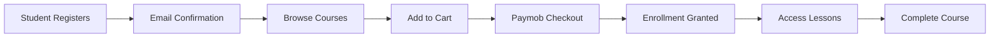
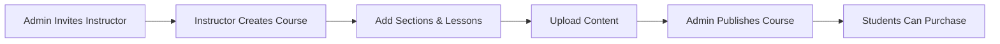

# 🎓 فالك التوفيق — LMS Frontend Development Plan

## Executive Summary

**فالك التوفيق** (Falk El-Tawfiq) is an Arabic-language educational platform specializing in preparing students for **capability tests (اختبارات القدرات)**, **academic achievement tests (التحصيلي)**, and **gifted student programs (الموهبة)**. The platform offers structured learning paths (مسارات), video/written/quiz/PDF lessons, instructor management, and Paymob-based payments.

This plan outlines a complete **frontend LMS** built on top of the existing 42-endpoint REST API.

---

## 1. Business Analysis

### 1.1 User Roles

| Role | Description | Key Capabilities |
|---|---|---|
| **Student (طالب)** | Primary user, purchases and consumes courses | Register, browse courses, enroll, view lessons, take quizzes |
| **Instructor (مدرس)** | Content creator, invited by admin | Manage courses, create sections/lessons, upload videos/PDFs |
| **Admin (مسؤول)** | Platform operator | Invite instructors, publish/archive courses, manage instructors |

### 1.2 Business Model

| Feature | Detail |
|---|---|
| **Revenue** | Course sales via Paymob gateway |
| **Pricing** | Per-course with separate renewal pricing |
| **Course Lifecycle** | Draft → Published (admin approval) → Archived |
| **Content Types** | Written (HTML), Video (Bunny CDN), Quiz, PDF |
| **Authentication** | Cookie-based (HTTP-only), email confirmation required |

### 1.3 Key Business Flows





---

## 2. Theme & Design System

### 2.1 Design Direction (from provided mockup)

| Element | Specification |
|---|---|
| **Primary Color** | Deep Purple `#6B21A8` / `#7C3AED` |
| **Secondary Color** | Royal Blue `#3B82F6` |
| **Accent** | Vibrant Purple gradient `#8B5CF6 → #6366F1` |
| **Background** | Soft lavender white `#F5F3FF` with glassmorphism cards |
| **Typography** | Arabic-first (RTL), use **Tajawal** or **Cairo** Google Font |
| **Direction** | RTL (Right-to-Left) |
| **Cards** | Rounded corners (16px+), soft shadows, glassmorphic overlays |
| **Buttons** | Pill-shaped CTA with gradients, arrow icons (←) |
| **Illustrations** | AI/brain-themed hero images, modern gradients |
| **Stats** | Prominent counters (10k+ students, 98% satisfaction, 92%+ success) |
| **Animations** | Subtle micro-animations, hover effects, smooth transitions |

### 2.2 Layout Patterns

- **Navigation**: Sticky top nav with logo, links (الرئيسية، الدورات، المسارات، عن المنصة، تواصل معنا), auth buttons
- **Hero Section**: Large heading with gradient text, CTA buttons, floating brain illustration
- **Cards Grid**: 2-3 column responsive grid for courses/tracks
- **Footer**: Multi-column with links, social icons, copyright

---

## 3. Frontend Architecture

### 3.1 Technology Stack

| Layer | Technology | Rationale |
|---|---|---|
| **Framework** | Next.js 14+ (App Router) | SSR for SEO, RSC, built-in routing |
| **Language** | TypeScript | Type safety with API schemas |
| **Styling** | Vanilla CSS + CSS Variables | Full control, RTL support, design system |
| **State** | React Context + TanStack Query | Server state caching, optimistic updates |
| **Auth** | Cookie-based (httpOnly) | Matches API auth model |
| **Video Player** | Bunny Stream Player | Matches video CDN |
| **Forms** | React Hook Form + Zod | Validation matching API schemas |
| **i18n** | Arabic-first (future English support) | RTL-native |

### 3.2 Project Structure

```
src/
├── app/                          # Next.js App Router
│   ├── (public)/                 # Public pages (no auth)
│   │   ├── page.tsx              # Homepage (الرئيسية)
│   │   ├── courses/
│   │   │   ├── page.tsx          # Course catalog (الدورات)
│   │   │   └── [id]/
│   │   │       └── page.tsx      # Course detail
│   │   ├── tracks/
│   │   │   └── page.tsx          # Learning tracks (المسارات)
│   │   ├── about/
│   │   │   └── page.tsx          # About (عن المنصة)
│   │   └── contact/
│   │       └── page.tsx          # Contact (تواصل معنا)
│   │
│   ├── (auth)/                   # Auth pages
│   │   ├── login/page.tsx        # تسجيل الدخول
│   │   ├── register/page.tsx     # تسجيل جديد
│   │   ├── forgot-password/page.tsx
│   │   ├── reset-password/page.tsx
│   │   └── confirm-email/page.tsx
│   │
│   ├── (student)/                # Student dashboard (authenticated)
│   │   ├── dashboard/page.tsx    # Student home
│   │   ├── my-courses/page.tsx   # Enrolled courses
│   │   ├── course/[id]/
│   │   │   ├── page.tsx          # Course player
│   │   │   └── lesson/[lessonId]/page.tsx
│   │   ├── cart/page.tsx         # Shopping cart
│   │   ├── checkout/page.tsx     # Payment flow
│   │   ├── payment-status/page.tsx
│   │   └── profile/page.tsx      # Student profile
│   │
│   ├── (instructor)/             # Instructor panel
│   │   ├── dashboard/page.tsx
│   │   ├── courses/
│   │   │   ├── page.tsx          # My courses list
│   │   │   ├── new/page.tsx      # Create course
│   │   │   └── [id]/
│   │   │       ├── page.tsx      # Edit course
│   │   │       ├── sections/page.tsx
│   │   │       └── lessons/
│   │   │           ├── new/page.tsx
│   │   │           └── [lessonId]/page.tsx
│   │   └── profile/page.tsx
│   │
│   ├── (admin)/                  # Admin panel
│   │   ├── dashboard/page.tsx
│   │   ├── courses/page.tsx      # All courses management
│   │   ├── instructors/
│   │   │   ├── page.tsx          # Instructor list
│   │   │   ├── [id]/page.tsx     # Instructor detail
│   │   │   └── invite/page.tsx   # Invite instructor
│   │   └── settings/page.tsx
│   │
│   └── layout.tsx                # Root layout (RTL, fonts, theme)
│
├── components/
│   ├── ui/                       # Design system primitives
│   │   ├── Button.tsx
│   │   ├── Card.tsx
│   │   ├── Input.tsx
│   │   ├── Modal.tsx
│   │   ├── Badge.tsx
│   │   ├── Skeleton.tsx
│   │   └── ...
│   ├── layout/
│   │   ├── Navbar.tsx
│   │   ├── Footer.tsx
│   │   ├── Sidebar.tsx
│   │   └── DashboardLayout.tsx
│   ├── course/
│   │   ├── CourseCard.tsx
│   │   ├── CourseGrid.tsx
│   │   ├── CourseSyllabus.tsx
│   │   └── LessonPlayer.tsx
│   ├── lesson/
│   │   ├── WrittenLesson.tsx
│   │   ├── VideoLesson.tsx
│   │   ├── QuizLesson.tsx
│   │   └── PdfLesson.tsx
│   ├── cart/
│   │   ├── CartItem.tsx
│   │   └── CartSummary.tsx
│   └── instructor/
│       ├── CourseForm.tsx
│       ├── SectionManager.tsx
│       ├── LessonEditor.tsx
│       └── QuizBuilder.tsx
│
├── lib/
│   ├── api/                      # API client layer
│   │   ├── client.ts             # Fetch wrapper with cookie auth
│   │   ├── auth.ts               # Auth API calls
│   │   ├── courses.ts            # Course API calls
│   │   ├── lessons.ts            # Lesson API calls
│   │   ├── cart.ts               # Cart API calls
│   │   ├── payments.ts           # Payment API calls
│   │   ├── students.ts           # Student API calls
│   │   ├── instructors.ts        # Instructor API calls
│   │   └── admin.ts              # Admin API calls
│   ├── hooks/                    # Custom React hooks
│   │   ├── useAuth.ts
│   │   ├── useCourses.ts
│   │   ├── useCart.ts
│   │   └── usePayment.ts
│   ├── types/                    # TypeScript types (from API schemas)
│   │   ├── auth.ts
│   │   ├── course.ts
│   │   ├── lesson.ts
│   │   ├── cart.ts
│   │   ├── payment.ts
│   │   ├── student.ts
│   │   ├── instructor.ts
│   │   └── common.ts
│   └── utils/
│       ├── format.ts             # Price, date formatting
│       ├── validation.ts         # Zod schemas
│       └── constants.ts
│
└── styles/
    ├── globals.css               # CSS variables, reset, RTL
    ├── components.css            # Component styles
    └── themes.css                # Theme definitions
```

---

## 4. Page-by-Page Specification

### Phase 1: Public Pages & Auth (Week 1-2)

#### 4.1 Homepage (الرئيسية)
- Hero section with animated brain illustration & gradient text
- "مستقبلك يبدأ هنا مع فالك التوفيق" headline
- CTA: "ابدأ رحلتك الآن" + "شاهد كيف تعمل"
- Learning tracks cards (مسار التحصيلي, مسار القدرات, مسار موهبة)
- Stats counters (10k+ students, 98% satisfaction)
- Smart performance tracking section
- **API calls:** `GET /api/v1/courses` (featured)

#### 4.2 Course Catalog (الدورات)
- Grid of course cards with infinite scroll (cursor pagination)
- Each card: image, title, instructor, price
- Search/filter by track
- **API calls:** `GET /api/v1/courses?cursor=&pageSize=12`

#### 4.3 Course Detail Page
- Hero with course image, title, description
- Instructor avatar + name (linked to profile)
- Price + "أضف للسلة" CTA
- Accordion syllabus (sections → lessons with type icons)
- **API calls:** `GET /api/v1/courses/{id}`, `GET /api/v1/instructors/{id}`

#### 4.4 Auth Pages
- Login: email + password, forgot password link
- Register: firstName, lastName, email, phoneNumber, password
- Forgot Password: email input
- Reset Password: email + token + newPassword
- Email Confirmation: auto-confirm via URL params
- **API calls:** All `/api/v1/auth/*` endpoints

### Phase 2: Student Dashboard (Week 2-3)

#### 4.5 Student Dashboard
- Welcome message with student name
- Enrolled courses grid
- Continue learning quick-links
- **API calls:** `GET /api/v1/students/me`

#### 4.6 Cart Page
- List of cart items with course images, prices
- Remove item button
- Total price calculation
- "ادفع الآن" CTA
- **API calls:** `GET /api/v1/cart/items`, `DELETE /api/v1/cart/items/{courseId}`

#### 4.7 Checkout / Payment
- Payment method selection (Paymob)
- Redirect to Paymob checkout
- Payment status polling page
- Success/failure states
- **API calls:** `POST /api/v1/payments`, `GET /api/v1/payments/{id}`

#### 4.8 Course Player
- Sidebar: course sections/lessons navigation
- Main area: lesson content renderer
  - **Written**: Rich HTML/markdown renderer
  - **Video**: Bunny stream player with playback controls
  - **Quiz**: Interactive quiz with scoring
  - **PDF**: Embedded PDF viewer with download
- Progress tracking (frontend state)
- **API calls:** `GET /api/v1/courses/{id}`, `GET /api/v1/lessons/{id}`

#### 4.9 Student Profile
- View/edit firstName, lastName
- Display email, phone (read-only)
- **API calls:** `GET /api/v1/students/me`, `PATCH /api/v1/students/me`

### Phase 3: Instructor Panel (Week 3-4)

#### 4.10 Instructor Dashboard
- Overview: course count, status summary
- Quick actions: create course, view profile
- **API calls:** `GET /api/v1/instructor/me`

#### 4.11 Course Management
- List of instructor's courses with status badges
- Create course form (title, description, price, renewalPrice)
- Edit course: update details, upload picture
- Section manager: create, reorder, rename sections
- **API calls:** All `instructor: courses` endpoints

#### 4.12 Lesson Editor
- Create lesson: choose type (Written/Video/Quiz/PDF)
- **Written editor**: Rich text / markdown editor
- **Video upload**: Direct-to-Bunny upload with presigned URLs, progress bar
- **Quiz builder**: Visual question/answer builder with correct answer marking
- **PDF upload**: File upload with size display
- Reorder lessons via drag-and-drop
- **API calls:** All `instructor: lessons` endpoints

#### 4.13 Instructor Profile
- Edit name, bio, profile picture
- **API calls:** `GET/PATCH /api/v1/instructor/me`, `PATCH /api/v1/instructor/me/picture`

### Phase 4: Admin Panel (Week 4-5)

#### 4.14 Admin Dashboard
- Platform statistics overview
- Pending courses for review
- Instructor management

#### 4.15 Course Administration
- All courses table with status filter (Draft/Published/Archived)
- Publish/archive actions
- Cursor-paginated list
- **API calls:** `GET /api/v1/admin/courses`, `POST /api/v1/admin/courses/{id}/publish`, `POST /api/v1/admin/courses/{id}/archive`

#### 4.16 Instructor Administration
- Instructor list with soft-delete indicator
- Invite new instructor form
- View instructor details
- Delete instructor
- **API calls:** All `admin: instructors` endpoints, `POST /api/v1/admin/auth/instructors`

---

## 5. API Integration Strategy

### 5.1 API Client Architecture

```typescript
// lib/api/client.ts
const API_BASE = 'https://api.falk-el-tawfiq.com/api/v1';

async function apiFetch<T>(
  path: string,
  options?: RequestInit
): Promise<T> {
  const res = await fetch(`${API_BASE}${path}`, {
    ...options,
    credentials: 'include',  // Cookie-based auth
    headers: {
      'Content-Type': 'application/json',
      ...options?.headers,
    },
  });

  if (!res.ok) {
    const problem = await res.json();
    throw new ApiError(problem);
  }

  if (res.status === 204) return undefined as T;
  return res.json();
}
```

### 5.2 Auth State Management

```typescript
// Cookie-based auth — no token storage needed
// Check auth status via GET /api/v1/students/me
// 401 response = not authenticated → redirect to login
```

### 5.3 Pagination Hook

```typescript
function usePaginatedQuery<T>(
  queryKey: string[],
  fetchFn: (cursor?: string) => Promise<PaginatedResponse<T>>
) {
  // Uses TanStack Query's useInfiniteQuery
  // Cursor-based: pass nextCursor to next fetch
}
```

---

## 6. Development Phases & Timeline

| Phase | Scope | Duration | Priority |
|---|---|---|---|
| **Phase 1** | Design System + Public Pages + Auth | 2 weeks | 🔴 Critical |
| **Phase 2** | Student Dashboard + Cart + Payments + Course Player | 2 weeks | 🔴 Critical |
| **Phase 3** | Instructor Panel (Course/Lesson Management) | 2 weeks | 🟡 High |
| **Phase 4** | Admin Panel + Polish + Testing | 1-2 weeks | 🟡 High |
| **Phase 5** | Performance, SEO, Analytics, PWA | 1 week | 🟢 Medium |

**Total estimated: 8-9 weeks**

---

## 7. Key Technical Decisions

### 7.1 Authentication Flow
The API uses **HTTP-only cookies** (no JWT tokens in headers). This means:
- Use `credentials: 'include'` on all fetch calls
- Frontend never stores/reads tokens
- Auth status is checked by calling `GET /api/v1/students/me` (or instructor/admin equivalent)
- CORS must be configured on the API for the frontend domain

### 7.2 Video Playback (Bunny CDN)
- Instructor uploads: Use presigned URLs from `POST /api/v1/instructor/lessons` response
- Student playback: Use `playbackUrl` from `GET /api/v1/lessons/{id}` video field
- Embed Bunny Stream iframe player
- Handle `VideoStatus`: show "processing" state for `Pending`, error for `Failed`

### 7.3 Quiz Engine
- Render questions with multiple-choice answers
- Frontend scoring (compare against `isCorrect` flags)
- Display pass/fail based on `passingScore` threshold
- No server-side quiz submission API currently — frontend-only tracking

### 7.4 Course Enrollment Detection
- The API doesn't have an explicit enrollment check endpoint
- Enrollment is implied by:
  - Ability to access `GET /api/v1/lessons/{id}` without 403
  - Payment status = `Succeeded`
- Frontend should handle 403 on lesson access → show "purchase required" state

### 7.5 RTL & Arabic Support
- `dir="rtl"` on root HTML element
- CSS logical properties (`margin-inline-start`, `padding-inline-end`)
- Arabic Google Font (Tajawal/Cairo) with proper weight loading
- Mirrored navigation and layout

---

## 8. API Gaps & Recommendations

| Gap | Impact | Recommendation |
|---|---|---|
| No enrollment list endpoint | Can't show "my courses" | Request `GET /api/v1/students/me/enrollments` from backend team |
| No quiz submission/scoring API | Quiz results not persisted | Request `POST /api/v1/lessons/{id}/quiz/submit` |
| No progress tracking API | Can't track course completion | Request `POST /api/v1/lessons/{id}/complete` + `GET /api/v1/courses/{id}/progress` |
| No search/filter on courses | Limited discoverability | Request query params: `?search=`, `?trackId=`, `?sortBy=` |
| No instructor course listing | Instructor can't see own courses | Request `GET /api/v1/instructor/courses` |
| No course deletion | Instructor can't delete drafts | Request `DELETE /api/v1/instructor/courses/{id}` |
| No section deletion | Can't remove sections | Request `DELETE /api/v1/instructor/sections/{id}` |
| No webhook verification docs | Security concern | Document webhook signature verification |
| No rate limiting info | Could affect UX | Document rate limits per endpoint |

---

## 9. Performance Strategy

| Strategy | Implementation |
|---|---|
| **SSR/SSG** | Static generation for public pages, SSR for authenticated |
| **Image Optimization** | Next.js Image component with Bunny CDN |
| **Lazy Loading** | Dynamic imports for PDF viewer, quiz builder, rich editor |
| **Caching** | TanStack Query with stale-while-revalidate |
| **Bundle Splitting** | Separate chunks per route group |
| **Prefetching** | Link prefetch for likely navigation targets |

---

## 10. File Reference

All API endpoint documentation is available in the `api-docs/` folder:

| File | Contents |
|---|---|
| `00-overview.md` | API general info, tags, error format, enums, pagination |
| `01-auth.md` | Auth endpoints (register, login, logout, password reset) |
| `02-students.md` | Student profile endpoints |
| `03-courses.md` | Course public, instructor, and admin endpoints |
| `04-lessons.md` | Lesson access and instructor CRUD endpoints |
| `05-instructors.md` | Instructor public, self, and admin endpoints |
| `06-cart.md` | Shopping cart endpoints |
| `07-payments.md` | Payment creation, status, and webhook endpoints |
| `08-schemas.md` | Complete request/response schema reference |
| `openapi_v1.json` | Raw OpenAPI 3.1.1 specification |
